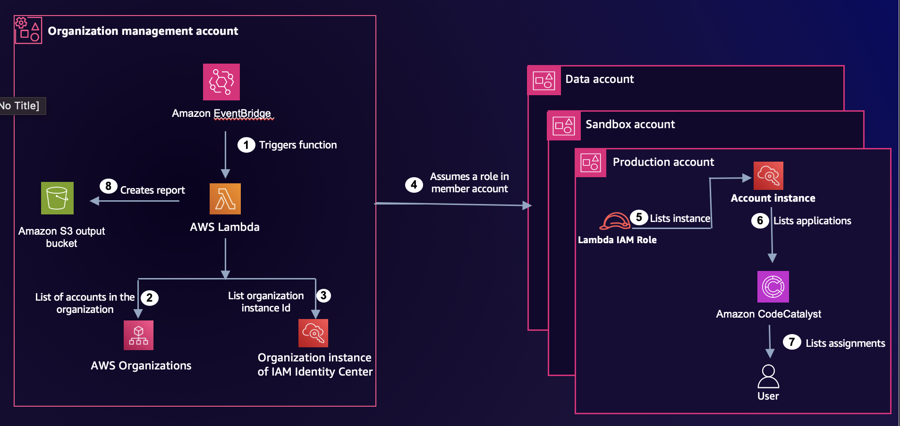

# Managing Multiple Account Instances in IAM Identity Center

You can now deploy multiple account instances of AWS IAM Identity Center in your AWS organizations to support authentication for AWS managed applications, such as Amazon Redshift. This solution generates reports to provide visibility into users across multiple IAM Identity Center instances deployed in your AWS organizations. The solution comprises of a script that generates information to help you manage multiple IAM Identity Center instances. The solution also includes a Python script that generates information to help you manage multiple IAM Identity Center instances.

## Key Terms

This solution involves two types of instances:

- 	**Organization instance:** The primary IAM Identity Center instance deployed at the AWS Organizations management level. It serves as the central identity source and manages users, groups, and access across all member accounts.

- 	**Account instance**: A local IAM Identity Center instance deployed within an individual member account. Account instances allow teams to manage their own applications and user assignments independently but may result in duplicate users across the organization.

The reports generated by this solution help you track and reconcile these instances, including identifying duplicate users that exist across both your organization instance and one or more account instances.

The python script will provide you with the following reports:

- 	**Account instances summary:** The accounts and IAM Identity Center instances deployed in each.
- 	**User duplication:** All duplicated users and the IAM Identity Center instances they belong to. A duplicated user is one that appears in more than one IAM Identity Center instance. Email compares users.
- 	**Application assignments on local instances:** The users assigned to each application

## Solution overview

The solution deploys an AWS Lambda function in your management or delegated administrator account that runs on a scheduled basis, assumes a cross-account role into each member account, and aggregates Identity Center instance and user data into reports stored in Amazon S3. The following steps describe the Lambda execution flow:

1.	Gets triggered based on the set cron schedule.
2.	Lists all accounts in AWS Organizations.
3.	Gets the organization instance of the IAM Identity Center ID.
4.	Assumes a role in each member account.
5.	Lists the account instance of IAM Identity Center, and captures the ID.
6.	Lists applications assigned to each IAM Identity Center instance.
7.	Lists user assignments to each application.
8.	Generates and uploads reports to the Amazon S3 bucket `idc-report-<StackId>`.

## How to deploy this solution?
Deploy this script in a Lambda in the account where your IAM Identity Center is managed or in the account assigned as a [delegated administrator for AWS Organizations](https://docs.aws.amazon.com/organizations/latest/userguide/orgs_delegate_policies.html).(The script and templates you need to deploy this solution are available in the repository.) To successfully deploy this solution, you need a Lambda deployment package, an Amazon S3 bucket to upload the package to, and an AWS Identity and Access Management (IAM) role that can be assumed by Lambda in each member account. For ease of deployment in `us-east-1` Region, the Lambda package is uploaded to an Amazon S3 bucket and configured in the AWS CloudFormation template. If you want to deploy this in another AWS Region, upload the Lambda package to a bucket of your choice in that Region, and update the `S3Bucket` and `S3Key` properties in the CloudFormation template.

Follow these steps to deploy the solution:

**Deploy the CloudFormation template:** 
- This repository includes two CloudFormation templates: `member-account-role.yaml` and `management-account-infrastructure.yaml`. 
    - If you do not have a cross-account role, you can use `member-account-role.yaml` to create one. To deploy this template input your management or delegated admin account ID. You can use [CloudFormation StackSets](https://docs.aws.amazon.com/AWSCloudFormation/latest/UserGuide/what-is-cfnstacksets.html) to deploy this template across multiple accounts. 
    - The `management-account-infrastructure.yaml` file creates resources you need. To deploy this template, input both the name of the Amazon S3 bucket where your deployment package is, and the cross-account role name. If you used the `member-account-role.yaml` to create the role, you can use the default value of the `CrossAccountRoleName` parameter. 

**Deployment considerations:**
- The Lambda function needs access to your member accounts, so you need to provide a cross-account role. If you are using an existing role, make sure it includes all the required permissions listed in the Other considerations section.
- After `management-account-infrastructure.yaml` finishes deploying the resources, you can trigger your new Lambda and review the report in the Amazon S3 bucket named idc-report-<StackId>.
- The Lambda function is scheduled to be triggered once a day at 12:00 AM UTC. 

## Other considerations

For this solution to work correctly, the Lambda execution role and the cross-account role each require specific permissions. Review the following lists to verify your roles are configured properly.

1.	The Lambda execution role will need:
-	Organizations read permissions
-	IAM Identity Center read permissions
-	Permissions to assume a role in each child account in the organization
-   PutObject permissions on the Amazon S3 bucket
2. Lambda cross account role:
- 'sso:ListInstances'
- 'identitystore:ListUsers'
- An assume role policy: Principal: AWS: arn:aws:iam::${ManagementAccountId}:role/lambda-execution-role

## Security

See [CONTRIBUTING](../CONTRIBUTING.md#security-issue-notifications) for more information.

## License

This library is licensed under the MIT-0 License. See the LICENSE file.

